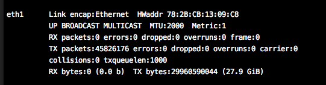

# debug记录

## bug1

#### 现象

重放数据包时，发送的数据包数目和接收到的数据包数目不一致，存在较多的丢包情况。

#### 分析

查看网卡接收数据包情况，使用ifconfig工具，发现较多的丢包。初步判定其丢包是在网卡层，未到达业务逻辑层。查看原始数据包，发现数据包的数据较长。查看发包机器的mtu，发现其mtu值是2000。查看接收数据包的机器，发现其mtu是1500。猜测是两台设备之间网卡mtu导致。

#### 解决

设置接收端设备的mtu值。验证后发现，丢包问题解决。

#### 工具

**ifconfig**

设置eth1网口的MTU为2000: ```ifconfig eth1 mtu 2000```

#### 截图



******

**注:**

1、图中的`MTU:2000`即为该网卡的mtu长度。

2、图中的`RX packets:0 errors:0 dropped:0 `即该网卡接收到的数据包的情况，分别是收到数据包的总数，错误包数目和丢弃包数目。

3、图中的`TX packets:45826176 errors:0, dropped:0`，即网卡转发数据包情况统计。

## bug2

#### 现象

业务软件运行在两种平台上：x86和MIPS。某次测试中，业务软件在x86平台上运行正常，但在另一种平台上运行错误，总是出现进程意外段错误。

#### 分析

由于业务逻辑在两种平台上运行是相同的，且出现段错误的测试用例在x86平台不会出现。故判断业务逻辑层没有问题。猜测是系统适配层处理不通系统时错误。使用gdb调试后发现，调用的函数，其内部的参数判断逻辑缺失，导致传入空指针。为排除编译器问题，首先将编译选项中优化级别o3改为o0，编译后执行。问题不再出现。

#### 解决

根据上述猜测，认为是编译器优化的错误。查看源码后，将源码的参数检查逻辑更为多次检查，这样代码量由一行变为多行，编译后运行测试，不再出现该问题。

#### 工具

**gdb**

```
	gdb XXXXX    //XXXXX--是程序名
	attach 20008  //绑定线程。20008---是进程号，每次运行时不同。使用ps命令查看
	frame   4   //切换栈帧。4--是栈帧号。根据bt命令信息切换正确的栈帧。
	bt     //查看此时进程的堆栈状态
```

#### 小结

编译的优化有可能改变原有的代码执行逻辑。因此在开发中，首先应该使用o0选项编译，待测试（不包含性能测试）通过后，将优化选项更改为o3，作进一步的测试并优化。

## bug3

#### 现象
1、业务软件在MIPS平台上，出现进程段错误问题，在去除新增的功能后，此问题不出现。
   
2、初步判断是新增功能引进的问题。在更改不同工作模式后，经过反复测试，均出现问题。（测试用例有随机性，故并不是每次都会出现问题） 
  
3、在x86平台上，无论增加新功能与否，都不会出现这个问题。判断是新增功能在特殊平台运行的错误。 
  
4、根据gdb信息，增加业务检查逻辑。

#### 分析
1、去除新增功能后，由于问题不再出现，因此猜测是新增功能引进的问题。

2、由于测试用例含有随机性，修改此测试用例，使得测试用例不含随机性。发现某些用例不出现问题，某些出问题。猜测特定的处理逻辑存在问题。

3、增加业务检查逻辑，问题同样出现。判断问题在检查逻辑之后出现。缩小问题范围。

4、增加业务清理逻辑，发现清理阶段的业务数据存在问题。

5、检查缩小范围后的代码，发现指针释放存在问题。修改此问题。

#### 解决
在检查代码后，发现指针释放存在问题。即，数据释放后，未能及时将数据指针置``NULL``，导致后续的空指针检查失败。并进而影响进程正常的运行。

#### 小结
* C语言中的指针操作，需要特别小心。对于自己分配的内存，需要及时的释放，并将指针置``NULL``，避免``野指针``问题。
* 解决此次``野指针``问题，耗时一周。
* 自己挖的坑，含着泪也要填上。

