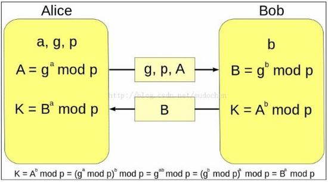

# IPSec

## 简介

IPSec是一个开放的

>Wikipedia

>In computing, Internet Protocol Security (IPsec) is a network protocol suite that authenticates and encrypts the packets of data sent over a network. IPsec includes protocols for establishing mutual authentication between agents at the beginning of the session and negotiation of cryptographic keys to use during the session. IPsec can protect data flows between a pair of hosts (host-to-host), between a pair of security gateways (network-to-network), or between a security gateway and a host (network-to-host).Internet Protocol security (IPsec) uses cryptographic security services to protect communications over Internet Protocol (IP) networks. IPsec supports network-level peer authentication, data-origin authentication, data integrity, data confidentiality (encryption), and replay protection.

>IPsec is an end-to-end security scheme operating in the Internet Layer of the Internet Protocol Suite, while some other Internet security systems in widespread use, such as Transport Layer Security (TLS) and Secure Shell (SSH), operate in the upper layers at the Transport Layer (TLS) and the Application layer (SSH). IPsec can automatically secure applications at the IP layer.

## 加密原理

### 非对称加解密
简单的来说，非对称的加密解密中，加密密钥和解密密钥是不同的。典型的非对称加解密算法有：RSA、。

RSA加密例子如下：

* 假设有两个素数：p=47, q=59, 此时n=p*q=2773
* t=(p-1)*(q-1)=2668
* 取e=63, 则d=847，满足e*d%t==1
* 取消息M=244，加密：c=M^d%n=244^847%2773=465
* 解密：m=c^e%n=465^63%2773=244

### Diffle-Hellman

原理：Diffle-Hellman，以下简称DH，需要参与者事先定义一个组，在这个组中定义一个大质数p，和底数g。DH交换是一个两部分的过程，假定参与者只有两人，分别是A和B。A和B都需要一个私有的数字a, b.

交换过程如下图：

例如：

1. A和B事先约定p=23以及g=5；
2. A选择一个秘密的数字A_private=6，计算A_public=g^A_private mod p，将计算结果A_public发送给B。即A_public=5^6 mod 23 = 8.
3. B同样选择一个秘密整数B_private=15，计算B_public=g^B_private mod p，将计算结果发送给A。即B_public=5^15 mod 23 = 19.
4. A计算s=B_public^A_private mod p = 19^6 mod 23 = 2.
5. B计算s=A_public^B_private mod p = 8^15 mod 23 = 2.

## 协议组成

## 工作模式

## 报文定义

## 报文分析

## 参考
1. [DH密钥交换](https://www.tuicool.com/articles/em6zEb)
2. [RFC2409 IKE](https://tools.ietf.org/html/rfc2409)
3. [RFC 5996 IKEv2](https://www.ietf.org/rfc/rfc5996.txt)