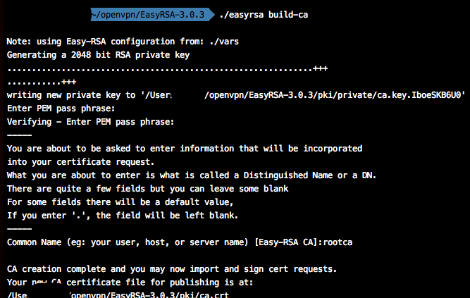
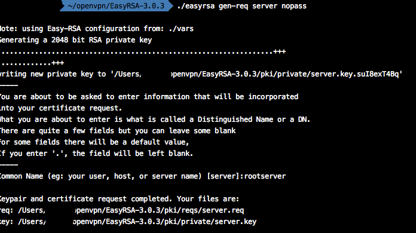
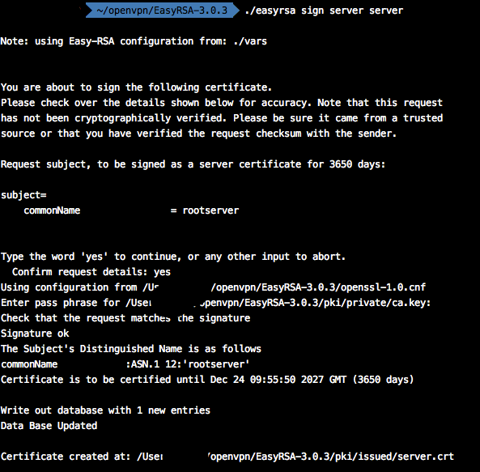
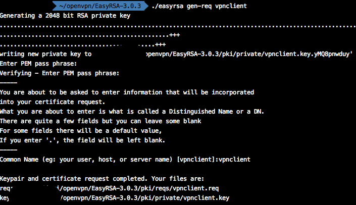

# openVPN服务器搭建

## static key配置

### 使用环境
Client：Windows 10

Server: Ubuntu 14.04

### 搭建过程
1、server端安装openvpn：```sudo apt-get install openvpn```;   
2、Client端安装openvpn;   
3、生成static.key：

```
openvpn --genkey --secret static.key
``` 
4、Server配置如下：

```
dev tun
ifconfig 10.8.0.1 10.8.0.2
secret static.key
push "redirect-gateway def1 bypass-dhcp"   //允许客户端重定向穿越VPN到外网
push "dhcp-option DNS 8.8.8.8"    //配置服务端的DNS
push "dhcp-option DNS 8.8.4.4"
```

5、Server路透设置

```
iptables -t nat -A POSTROUTING -s 10.8.0.0/24 -j SNAT --to-source server公网IP
```

6、Client配置如下：

```
remote xxxxx
dev tun      //基于路由的隧道
ifconfig 10.8.0.2 10.8.0.1
secret static.key
redirect-gateway def1     //使客户端中所有的流量都经过vpn
dhcp-option DNS 8.8.8.8    //设置客户端VPN的DNS
dhcp-option DNS 8.8.4.4
```
**注：**  

	1、 xxxxxx---server的IP或者域名。

### 配置说明

secret --- 指定static key文件


## 标准配置

### 使用环境

同上

### 搭建步骤

标准的配置即使用非对称加密方法，提高安全性。因此需要生成证书、公钥、私钥等。

#### 证书制作
此处使用openvpn官方推荐的easy-rsa工具，生成证书等。

1、获取easy-rsa，解压并进入此目录下。

2、目录下有个vars.example文件，复制一份出来：  
`` cp vars.example vars ``

3、修改vars文件，设置注册信息，便于后续生成根证书。主要配置如下：

```
set_var EASYRSA_REQ_COUNTRY	"US"  #设置所在的国家
set_var EASYRSA_REQ_PROVINCE	"California"  #设置所在的省份
set_var EASYRSA_REQ_CITY	"San Francisco"   #设置所在的城市
set_var EASYRSA_REQ_ORG	"Copyleft Certificate Co"   #设置所在的组织
set_var EASYRSA_REQ_EMAIL	"me@example.net"    #设置邮箱名称
set_var EASYRSA_REQ_OU	"My Organizational Unit"  #设置机构单位或部门名称
```
直接可用的配置文件，参考[Easy-RSA 3 HowTo](https://sskaje.me/easy-rsa/)。

4、进入easy-rsa目录，初始化，并创建根证书：

```
./easyrsa init-pki   #初始化目录，创建pki目录
./easyrsa build-ca   #创建根证书
```
创建根证书的输出如下：



需要输入两次密码和证书名称，请记住密码和名称。

5、创建服务端证书：

```
./easyrsa gen-req server nopass
```
其输出为：



6、签名服务器证书：

```
./easyrsa sign server server
```
在输入创建CA时的密码后，其输出为：



7、创建大名鼎鼎的DH（了解IPSec的都知道）：

```
./easyrsa gen-dh
```
长度越长，花费的时间越长。

**************

**以下步骤为：创建客户端证书**

8、拷贝前面下载的Easy-RSA3文件，解压得到新的Easy-RSA目录，不要和上述创建服务器端的证书等一个目录。

9、进入到刚才解压得到的Easy-RSA目录。执行初始化：

```
./easyrsa init-pki
```

10、创建客户端key，并生成证书。

```
./easyrsa gen-req vpnclient
```
输入密码和名称后，其输出如下：



#### 配置文件


## 参考
1、[openvpn Windows client下载地址](https://swupdate.openvpn.org/community/releases/openvpn-install-2.4.4-I601.exe)   
2、[openvpn mini配置](https://openvpn.net/index.php/open-source/documentation/miscellaneous/78-static-key-mini-howto.html)   
3、[easy-rsa](https://github.com/OpenVPN/easy-rsa)

